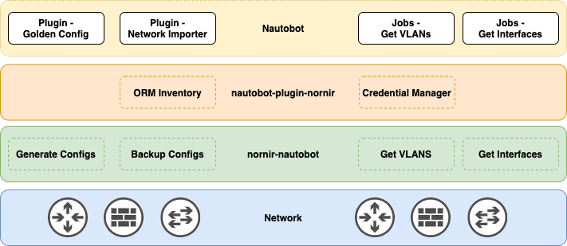

# App Overview

## Description/Overview

A plugin for [Nautobot](https://github.com/nautobot/nautobot), that intends to be a small shim layer between [nornir-nautobot](https://github.com/nautobot/nornir-nautobot) and other plugins. The primary abilities that the plugin provides is a native Nornir ORM based inventory and a credential manager.

As of the writing of this readme, the only plugin leveraging this plugin is the [golden-config](https://github.com/nautobot/nautobot-plugin-golden-config). However, future plugins are planned, such as the "network importer".

That being said, there is currently little reason to install this plugin by itself, without an enabler, which can be seen represented as the white rectangles inside the yellow rectangle in the diagram above. An enabler could be a Plugin, Job, or another piece of code like a Chatops command.

## Audience (User Personas) - Who should use this App?

* Plugin developers - looking to create integrations via Nautobot with Nornir
* Users - looking to leverage those plugins
* Users - looking to run Nornir via an API and UI (via Nautobot Jobs)

## Authors and Maintainers

* itdependsnetworks
* jeffkala
